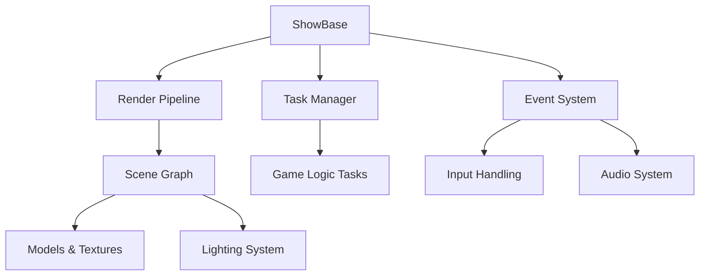

# Panda3DGuide.md

## Page 1: Panda3D Setup & Python 3.11 Compatibility

### System Requirements & Installation
Panda3D is a powerful 3D engine written in C++, with a complete set of Python bindings that are automatically generated.  For Python 3.11 compatibility:

```bash
# Create virtual environment
python -m venv backrooms_env
source backrooms_env/bin/activate  # Linux/Mac
# backrooms_env\Scripts\activate  # Windows

# Install Panda3D
pip install panda3d==1.11.0  # Latest stable version as of 2025
```

**Troubleshooting Installation Issues:**
- If you encounter "No version that satisfies the requirement panda3d" errors with Python 3.11.4, ensure you're using the correct wheel format. 
- For Windows users: Right-click installer as administrator, check "Add Python to PATH", and select "Install for all users". 
- Panda3D has supported Python 3.11 since version 1.11.0, but verify compatibility with your specific OS version. 

### Verification Script
```python
from direct.showbase.ShowBase import ShowBase

class Verification(ShowBase):
    def __init__(self):
        ShowBase.__init__(self)
        self.accept("escape", self.userExit)
        print("✅ Panda3D 1.11.0 successfully initialized with Python 3.11")

app = Verification()
app.run()
```

## Page 2: Core Panda3D Architecture for Horror Games

### Essential Components


### Critical Systems for Backrooms-Style Games:
1. **Scene Graph Management**: Hierarchical node structure for infinite level generation
2. **Procedural Content Pipeline**: On-demand chunk loading/unloading
3. **Atmospheric Audio System**: 3D positional audio with distance falloff
4. **Dynamic Lighting**: Limited visibility through point lights
5. **Post-Processing Effects**: For reality distortion effects

### Base Game Structure
```python
from direct.showbase.ShowBase import ShowBase
from direct.task import Task

class BackroomsGame(ShowBase):
    def __init__(self):
        ShowBase.__init__(self)
        self.disableMouse()  # Essential for FPS controls
        
        # Core systems initialization
        self.setup_render_pipeline()
        self.setup_audio_system()
        self.setup_player_controller()
        self.setup_world_generator()
        
        # Schizophrenic layer system
        self.reality_stability = 1.0  # 1.0 = stable, 0.0 = completely distorted
        self.hallucination_level = 0.0
        
        # Task scheduling
        self.taskMgr.add(self.update_game_state, "GameStateTask")
        self.taskMgr.add(self.update_reality_layer, "RealityLayerTask")
    
    def setup_render_pipeline(self):
        """Configure lighting and post-processing"""
        self.render.setShaderAuto()  # Enable auto-shader generation
        self.render.setAntialias(AntialiasAttrib.MAuto)
        base.setBackgroundColor(0.1, 0.1, 0.15)  # Dark blue-gray for loneliness aesthetic
        
    def update_game_state(self, task):
        """Main game loop"""
        dt = globalClock.getDt()
        
        # Reality stability decay based on player actions
        if self.player.is_moving_fast or self.player.has_seen_hallucination:
            self.reality_stability = max(0.0, self.reality_stability - 0.1 * dt)
        
        # Gradual recovery when calm
        else:
            self.reality_stability = min(1.0, self.reality_stability + 0.05 * dt)
        
        return Task.cont
```

## Page 3: Procedural Backrooms World Generation

### Infinite Chunk System
```python
class WorldGenerator:
    def __init__(self, seed=None):
        self.seed = seed or random.randint(0, 999999)
        random.seed(self.seed)
        self.chunk_size = 16  # 16x16 meter chunks
        self.loaded_chunks = {}
        self.visible_chunks = set()
        self.noise_generator = OpenSimplexNoise(self.seed)  # Better than standard noise
    
    def generate_chunk(self, chunk_x, chunk_z):
        """Generate a single chunk using 3D noise"""
        chunk_node = NodePath(f"chunk_{chunk_x}_{chunk_z}")
        
        # Generate walls and geometry
        for x in range(self.chunk_size):
            for z in range(self.chunk_size):
                world_x = chunk_x * self.chunk_size + x
                world_z = chunk_z * self.chunk_size + z
                
                # Height determined by 3D noise
                height = self._get_height(world_x, world_z)
                
                # Wall generation probability based on noise
                wall_prob = self.noise_generator.noise2(world_x * 0.1, world_z * 0.1)
                
                if wall_prob < -0.3:  # Hallway sections
                    self._create_wall(chunk_node, world_x, world_z, height)
                elif wall_prob < 0.2 and random.random() < 0.3:  # Random room sections
                    self._create_wall(chunk_node, world_x, world_z, height)
        
        return chunk_node
    
    def _get_height(self, x, z):
        """Get wall height with procedural variation"""
        base_height = 3.0  # Standard Backrooms height
        variation = self.noise_generator.noise2(x * 0.05, z * 0.05) * 0.5
        return base_height + variation
    
    def update_chunks(self, player_pos):
        """Load/unload chunks based on player position"""
        current_chunk = (
            int(player_pos.x // self.chunk_size),
            int(player_pos.z // self.chunk_size)
        )
        
        # Unload distant chunks
        for chunk_pos in list(self.loaded_chunks.keys()):
            distance = math.sqrt(
                (chunk_pos[0] - current_chunk[0])**2 +
                (chunk_pos[1] - current_chunk[1])**2
            )
            if distance > 2:  # Unload chunks beyond 2 chunks away
                self.unload_chunk(chunk_pos)
        
        # Load nearby chunks
        for dx in range(-2, 3):
            for dz in range(-2, 3):
                chunk_pos = (current_chunk[0] + dx, current_chunk[1] + dz)
                if chunk_pos not in self.loaded_chunks:
                    self.load_chunk(chunk_pos[0], chunk_pos[1])
```

### Material System for Unease
```python
def create_backrooms_material():
    """Create the signature Backrooms yellow material with variations"""
    mat = Material()
    
    # Base color with subtle variation for unease
    base_hue = 0.15  # Yellow hue
    hue_variation = 0.02 * random.random()  # Small random variation
    color = LColor.from_hsv(base_hue + hue_variation, 0.15, 0.95)
    
    mat.set_diffuse(color)
    mat.set_roughness(0.7)  # Slightly rough for realistic lighting
    
    # Subtle imperfection textures
    tex = loader.loadTexture("textures/wall_stain.png")
    tex.setWrapU(Texture.WM_repeat)
    tex.setWrapV(Texture.WM_repeat)
    tex.setMinfilter(Texture.FT_linear_mipmap_linear)
    
    # Apply texture with random UV offset for uniqueness
    uv_offset = LVecBase2f(random.random(), random.random())
    mat.set_texture(tex, uv_offset)
    
    return mat
```

## Page 4: Horror & Loneliness Aesthetics Implementation

### Atmospheric Lighting System
```python
class AtmosphericLighting:
    def __init__(self, render):
        self.render = render
        self.light_sources = []
        self.ambient_level = 0.2  # Base darkness level
        
    def setup_dynamic_lights(self):
        """Create limited visibility through dynamic lights"""
        # Player flashlight
        self.flashlight = PointLight("player_flashlight")
        self.flashlight.set_color((1.0, 0.9, 0.8, 1.0))  # Warm white
        self.flashlight.set_attenuation((0.0, 0.5, 0.01))  # Quadratic attenuation
        self.flashlight_node = render.attach_new_node(self.flashlight)
        
        # Distant flickering lights
        for i in range(5):
            light = PointLight(f"ambient_light_{i}")
            light.set_color((0.8, 0.85, 1.0, 1.0))  # Cool blue-white
            light.set_attenuation((0.0, 0.3, 0.02))
            node = render.attach_new_node(light)
            node.set_pos(
                random.uniform(-50, 50),
                random.uniform(1.5, 2.5),
                random.uniform(-50, 50)
            )
            self.light_sources.append({
                'node': node,
                'base_intensity': random.uniform(0.3, 0.7),
                'flicker_speed': random.uniform(0.5, 3.0),
                'flicker_amount': random.uniform(0.2, 0.6)
            })
        
        render.set_light(self.flashlight_node)
    
    def update(self, player_pos, dt):
        """Update lighting based on player position and reality state"""
        # Move flashlight with player
        self.flashlight_node.set_pos(player_pos + (0, 0.5, 0))
        
        # Update flickering lights
        for light in self.light_sources:
            base = light['base_intensity']
            speed = light['flicker_speed']
            amount = light['flicker_amount']
            
            # Flicker intensity
            flicker = (math.sin(globalClock.get_frame_time() * speed) + 1) * 0.5
            intensity = base + flicker * amount
            
            # Distance-based dimming
            dist = light['node'].get_pos().distance_to(player_pos)
            if dist > 15.0:
                intensity *= max(0.0, 1.0 - (dist - 15.0) / 10.0)
            
            # Reality distortion affects light stability
            if reality_stability < 0.7:
                intensity *= (0.5 + random.random() * 0.5)
            
            light['node'].set_color((intensity, intensity, intensity, 1.0))
```

### Psychological Audio Design
```python
class PsychologicalAudio:
    def __init__(self):
        self.audio3d = Audio3DManager(base.sfxManagerList[0], camera)
        self.ambience = self.audio3d.load_sfx("sounds/ambience_loop.ogg")
        self.ambience.set_loop(True)
        self.ambience.set_volume(0.4)
        self.ambience.play()
        
        # Distance-based audio sources
        self.audiosources = []
        self.sanity_threshold = 70.0  # Below this, hallucinations start
        
    def add_audio_source(self, position, sound_file, min_distance=10.0, max_distance=30.0):
        """Add a positional audio source that plays when player is near"""
        source = self.audio3d.load_sfx(sound_file)
        source.set_loop(True)
        source.set_volume(0.0)  # Start silent
        node = render.attach_new_node("audio_source")
        node.set_pos(position)
        self.audio3d.attach_sound_to_object(source, node)
        source.set_min_distance(min_distance)
        source.set_max_distance(max_distance)
        source.play()
        
        self.audiosources.append({
            'sound': source,
            'node': node,
            'base_volume': 0.7,
            'trigger_distance': 15.0
        })
    
    def update(self, player_pos, sanity_level):
        """Update audio based on player position and mental state"""
        for source in self.audiosources:
            dist = source['node'].get_pos().distance_to(player_pos)
            
            # Normal volume based on distance
            volume = 0.0
            if dist < source['trigger_distance']:
                volume = source['base_volume'] * (1.0 - dist / source['trigger_distance'])
            
            # Hallucination effect when sanity is low
            if sanity_level < self.sanity_threshold:
                # Random volume spikes
                if random.random() < 0.05:
                    volume = max(volume, random.uniform(0.8, 1.2))
                
                # Whispering voices effect
                if random.random() < 0.1:
                    whisper = loader.load_sfx("sounds/whisper.ogg")
                    whisper.play()
            
            source['sound'].set_volume(volume)
```

## Page 5: Schizophrenic Reality Distortion System

### Core Reality Engine
```python
class RealityEngine:
    def __init__(self):
        self.reality_stability = 1.0  # 1.0 = completely stable
        self.hallucination_level = 0.0
        self.distortion_effects = []
        
        # Initialize distortion effects
        self.setup_distortion_effects()
    
    def setup_distortion_effects(self):
        """Prepare visual and audio distortion effects"""
        # Screen distortion shader
        self.distortion_shader = Shader.load(Shader.SL_GLSL, 
            vertex="shaders/distortion.vert",
            fragment="shaders/distortion.frag"
        )
        
        # Audio distortion filter
        self.audio_filter = AudioFilter()
        
        # Hallucination entities
        self.hallucination_entities = []
        self.entity_spawn_timer = 0.0
    
    def update(self, dt, player_actions):
        """Update reality state based on player actions and time"""
        # Calculate reality decay based on stressors
        stress_factors = 0.0
        
        # Darkness stress
        if player_actions['in_darkness'] > 0.5:
            stress_factors += 0.3 * player_actions['in_darkness']
        
        # Isolation stress
        if player_actions['time_since_last_sound'] > 60.0:
            stress_factors += 0.2 * (player_actions['time_since_last_sound'] / 60.0)
        
        # Hallucination exposure stress
        if player_actions['hallucination_visible']:
            stress_factors += 0.4
        
        # Update reality stability
        decay_rate = 0.1 * stress_factors
        self.reality_stability = max(0.0, self.reality_stability - decay_rate * dt)
        
        # Hallucination level increases as reality stability decreases
        self.hallucination_level = 1.0 - self.reality_stability
        
        # Spawn hallucination entities when threshold reached
        if self.hallucination_level > 0.3 and self.entity_spawn_timer <= 0:
            self.spawn_hallucination_entity()
            self.entity_spawn_timer = random.uniform(5.0, 15.0)
        
        if self.entity_spawn_timer > 0:
            self.entity_spawn_timer -= dt
    
    def apply_screen_distortion(self, base):
        """Apply visual distortion effects to the screen"""
        if self.hallucination_level > 0.1:
            # Configure shader parameters
            base.shader.set_shader_input("distortion_amount", self.hallucination_level * 0.3)
            base.shader.set_shader_input("time", globalClock.get_frame_time())
            base.shader.set_shader_input("seed", random.random())
            
            # Apply shader to render pipeline
            base.render.set_shader(self.distortion_shader)
```

### Hallucination Entity System
```python
class HallucinationEntity:
    def __init__(self, reality_engine):
        self.reality_engine = reality_engine
        self.node = render.attach_new_node("hallucination_entity")
        self.model = loader.load_model("models/distorted_figure.bam")
        self.model.reparent_to(self.node)
        
        # Visual properties that change with reality stability
        self.base_color = (0.8, 0.2, 0.2, 1.0)  # Blood red
        self.flicker_speed = random.uniform(1.0, 5.0)
        self.transparency_cycle = 0.0
        
        # Behavior patterns
        self.behavior_type = random.choice(['follower', 'static', 'teleporter'])
        self.last_teleport_time = 0.0
        self.teleport_cooldown = random.uniform(3.0, 8.0)
    
    def update(self, player_pos, dt):
        """Update hallucination behavior based on reality state"""
        reality = self.reality_engine.reality_stability
        
        # Position update based on behavior type
        if self.behavior_type == 'follower':
            # Move toward player but with instability
            direction = player_pos - self.node.get_pos()
            distance = direction.length()
            
            if distance > 3.0:
                direction.normalize()
                move_speed = 0.5 + (1.0 - reality) * 2.0
                self.node.set_pos(self.node.get_pos() + direction * move_speed * dt)
        
        elif self.behavior_type == 'teleporter':
            if globalClock.get_frame_time() - self.last_teleport_time > self.teleport_cooldown:
                # Random teleport within player's view distance
                angle = random.uniform(0, math.pi * 2)
                radius = random.uniform(5.0, 15.0)
                new_x = player_pos.x + math.cos(angle) * radius
                new_y = player_pos.y
                new_z = player_pos.z + math.sin(angle) * radius
                
                self.node.set_pos(new_x, new_y, new_z)
                self.last_teleport_time = globalClock.get_frame_time()
        
        # Visual updates
        self._update_visuals(reality, dt)
    
    def _update_visuals(self, reality, dt):
        """Update visual properties based on reality stability"""
        # Color shifts with instability
        instability = 1.0 - reality
        hue_shift = instability * 0.3
        saturation = 0.5 + instability * 0.5
        
        # Calculate new color
        r, g, b, a = self.base_color
        color = LColor.from_hsv(
            (0.0 + hue_shift) % 1.0,  # Shift toward purple/blue
            saturation,
            0.7
        )
        
        # Flickering transparency
        self.transparency_cycle += dt * self.flicker_speed
        alpha = 0.4 + math.sin(self.transparency_cycle) * 0.3
        alpha *= (0.5 + instability * 0.5)  # More transparent when unstable
        
        # Apply to model
        self.model.set_color(color[0], color[1], color[2], alpha)
        
        # Visual distortion effects
        if instability > 0.5:
            scale_variation = 0.2 * instability
            self.model.set_scale(
                1.0 + random.uniform(-scale_variation, scale_variation),
                1.0 + random.uniform(-scale_variation, scale_variation),
                1.0 + random.uniform(-scale_variation, scale_variation)
            )
```

## Page 6: Player Controller with Psychological Elements

### Advanced Player Movement
```python
class PsychologicalPlayer(Actor):
    def __init__(self):
        Actor.__init__(self, "models/player", {
            "run": "models/player-run",
            "idle": "models/player-idle"
        })
        
        # Movement parameters
        self.speed = 5.0
        self.jump_force = 10.0
        self.gravity = -9.8
        self.velocity = LVector3(0, 0, 0)
        
        # Psychological state
        self.sanity = 100.0
        self.is_panicking = False
        self.panic_level = 0.0
        self.last_sanity_update = 0.0
        
        # Reality perception
        self.perceived_position = LPoint3(0, 0, 0)
        self.reality_shift_timer = 0.0
        
    def update(self, dt, reality_stability):
        """Update player state with psychological elements"""
        # Handle input
        self._handle_movement_input(dt)
        
        # Apply gravity
        self.velocity.z += self.gravity * dt
        
        # Update position
        self.set_pos(self.get_pos() + self.velocity * dt)
        
        # Floor collision (simplified)
        if self.get_z() < 0.0:
            self.set_z(0.0)
            self.velocity.z = 0.0
            self.set_play("idle")
        
        # Update psychological state
        self._update_psychological_state(dt, reality_stability)
        
        # Reality perception effects
        self._apply_reality_perception(dt, reality_stability)
    
    def _handle_movement_input(self, dt):
        """Handle keyboard input with panic effects"""
        move_speed = self.speed
        
        # Panic reduces control precision
        if self.is_panicking:
            move_speed *= (0.5 + self.panic_level * 0.5)
            # Add random movement jitter
            if random.random() < 0.1:
                self.velocity.x += random.uniform(-1.0, 1.0)
                self.velocity.y += random.uniform(-1.0, 1.0)
        
        # Standard WASD movement
        if base.mouseWatcherNode.has_mouse():
            if base.mouseWatcherNode.is_button_down("arrow_up") or base.mouseWatcherNode.is_button_down("w"):
                self.velocity.y = move_speed
            elif base.mouseWatcherNode.is_button_down("arrow_down") or base.mouseWatcherNode.is_button_down("s"):
                self.velocity.y = -move_speed
            else:
                self.velocity.y = 0
            
            if base.mouseWatcherNode.is_button_down("arrow_left") or base.mouseWatcherNode.is_button_down("a"):
                self.velocity.x = -move_speed
            elif base.mouseWatcherNode.is_button_down("arrow_right") or base.mouseWatcherNode.is_button_down("d"):
                self.velocity.x = move_speed
            else:
                self.velocity.x = 0
```

### Sanity System Implementation
```python
def _update_psychological_state(self, dt, reality_stability):
    """Update player's sanity based on environment and events"""
    current_time = globalClock.get_frame_time()
    
    # Time-based sanity recovery when calm
    if not self.is_panicking and current_time - self.last_sanity_update > 1.0:
        self.sanity = min(100.0, self.sanity + 0.5 * dt)
        self.last_sanity_update = current_time
    
    # Sanity drain from environmental factors
    sanity_drain = 0.0
    
    # Darkness effect
    if self.is_in_darkness():
        sanity_drain += 0.3
    
    # Isolation effect
    if self.time_since_last_sound > 30.0:
        sanity_drain += 0.1 * (self.time_since_last_sound / 30.0)
    
    # Hallucination exposure
    if self.can_see_hallucination:
        sanity_drain += 0.5
    
    # Reality instability effect
    if reality_stability < 0.5:
        sanity_drain += (0.5 - reality_stability) * 0.8
    
    # Apply sanity drain
    self.sanity = max(0.0, self.sanity - sanity_drain * dt)
    
    # Update panic state
    new_panic = self.sanity < 30.0
    if new_panic != self.is_panicking:
        if new_panic:
            self.start_panicking()
        else:
            self.stop_panicking()
    
    # Panic level intensity
    if self.is_panicking:
        self.panic_level = min(1.0, self.panic_level + dt * 0.2)
    else:
        self.panic_level = max(0.0, self.panic_level - dt * 0.3)
```

## Page 7: Performance Optimization for Infinite Worlds

### Level of Detail (LOD) System
```python
class LODManager:
    def __init__(self):
        self.lod_groups = {}
        self.view_distance = 50.0  # Base view distance
        self.reality_lod_factor = 1.0  # 1.0 = normal, lower = reduced detail
    
    def register_object(self, obj, position):
        """Register an object for LOD management"""
        lod_group = {
            'object': obj,
            'position': position,
            'current_lod': 2,  # 0=highest, 2=lowest
            'distances': [15.0, 30.0, 50.0]  # Distance thresholds
        }
        self.lod_groups[id(obj)] = lod_group
    
    def update(self, camera_pos):
        """Update LOD levels based on distance and reality state"""
        for group in self.lod_groups.values():
            distance = (group['position'] - camera_pos).length()
            
            # Adjust distance threshold based on reality stability
            reality_factor = self.reality_lod_factor
            adjusted_distances = [d * reality_factor for d in group['distances']]
            
            # Determine appropriate LOD level
            new_lod = group['current_lod']
            for i, dist in enumerate(adjusted_distances):
                if distance < dist:
                    new_lod = i
                    break
            
            # Update LOD if changed
            if new_lod != group['current_lod']:
                self._apply_lod(group['object'], new_lod)
                group['current_lod'] = new_lod
    
    def _apply_lod(self, obj, lod_level):
        """Apply specific LOD level to object"""
        if lod_level == 0:
            # High detail
            obj.set_model("models/high_detail")
            obj.set_texture("textures/high_detail")
            obj.set_shader(Shader.load(Shader.SL_GLSL, "shaders/high_quality"))
        elif lod_level == 1:
            # Medium detail
            obj.set_model("models/medium_detail")
            obj.set_texture("textures/medium_detail")
            obj.clear_shader()
        elif lod_level == 2:
            # Low detail (or impostor)
            if obj.has_impostor():
                obj.show_impostor()
            else:
                obj.set_model("models/low_detail")
                obj.set_texture("textures/low_detail")
```

### Memory Management for Infinite Worlds
```python
class MemoryManager:
    def __init__(self):
        self.max_chunks = 25  # Maximum loaded chunks
        self.chunk_queue = []
        self.last_cleanup_time = 0.0
    
    def register_chunk(self, chunk, position, priority=0.0):
        """Register a chunk for memory management"""
        self.chunk_queue.append({
            'chunk': chunk,
            'position': position,
            'priority': priority,
            'last_accessed': globalClock.get_frame_time(),
            'memory_usage': self._estimate_memory(chunk)
        })
        self.chunk_queue.sort(key=lambda x: x['priority'], reverse=True)
    
    def update(self, player_pos):
        """Manage memory usage and unload distant chunks"""
        current_time = globalClock.get_frame_time()
        
        # Update access times for nearby chunks
        for entry in self.chunk_queue:
            distance = (entry['position'] - player_pos).length()
            if distance < 30.0:  # Consider chunks within 30m as active
                entry['last_accessed'] = current_time
                entry['priority'] = max(entry['priority'], 1.0 - distance/30.0)
        
        # Cleanup if needed or periodically
        if len(self.chunk_queue) > self.max_chunks or current_time - self.last_cleanup_time > 10.0:
            self._perform_cleanup(player_pos)
            self.last_cleanup_time = current_time
    
    def _perform_cleanup(self, player_pos):
        """Unload chunks to free memory"""
        # Sort by priority (lowest first) and last accessed time
        self.chunk_queue.sort(key=lambda x: (x['priority'], x['last_accessed']))
        
        # Unload chunks until under limit
        while len(self.chunk_queue) > self.max_chunks and len(self.chunk_queue) > 5:
            entry = self.chunk_queue.pop(0)
            entry['chunk'].unload()
            entry['chunk'] = None
```

## Page 8: Packaging & Distribution for Maximum Atmosphere

### Build Configuration for Psychological Impact
```markdown
# config.prc - Critical configuration file for atmosphere
# Must be included in final build

# Rendering quality - balance performance and atmosphere
framebuffer-multisample 1
multisamples 4
textures-power-2 none
compressed-textures 1

# Audio configuration - essential for horror
audio-samplerate 48000
audio-channels 2
audio-format float32

# Window settings - immersive experience
win-size 1280 720
fullscreen 0
icon-filename icon.png
window-title "The Backrooms: Fragmented Reality"

# Performance settings
clock-mode limited
clock-frame-rate 60

# Disable debugging elements that break immersion
show-frame-rate-meter 0
show-render-stat 0
```

### Psychological Distribution Strategy
```python
def create_distribution_package():
    """Create distribution package with psychological elements"""
    # Final build command
    build_cmd = [
        "python", "-m", "direct.p3d.packager",
        "-d", "The Backrooms: Fragmented Reality",
        "-v", "1.0",
        "-o", "build/backrooms.p3d",
        "main.py"
    ]
    
    # Include audio files with specific naming to enhance unease
    audio_files = [
        ("sounds/ambience_loop.ogg", "sounds/distant_hum.ogg"),
        ("sounds/footstep_01.ogg", "sounds/footstep_slow.ogg"),
        ("sounds/whisper_01.ogg", "sounds/your_name_whisper.ogg"),
        ("sounds/door_close.ogg", "sounds/no_escape.ogg")
    ]
    
    # Texture naming for psychological effect
    texture_renames = {
        "wall_stain.png": "memory_fragment.png",
        "door.png": "exit_that_isnt_there.png",
        "figure.png": "thing_that_follows.png"
    }
    
    # Create manifest with psychological descriptions
    manifest = {
        "name": "The Backrooms: Fragmented Reality",
        "description": "A psychological exploration of infinite yellow rooms. Your sanity is the only map.",
        "requires": ["panda3d==1.11.0"],
        "launch_file": "main.py",
        "icon": "icon.png",
        "psychological_triggers": {
            "isolation_duration_threshold": 60,
            "hallucination_start_sanity": 70,
            "reality_fragmentation_point": 30
        }
    }
    
    # Write manifest
    with open("build/manifest.json", "w") as f:
        json.dump(manifest, f, indent=2)
```

### Post-Release Psychological Engagement
```python
class RealityTrackingSystem:
    def __init__(self):
        self.player_data = {}
        self.reality_events = []
        self.upload_timer = 0.0
    
    def track_reality_event(self, event_type, intensity, player_sanity):
        """Track significant psychological events"""
        event = {
            'timestamp': globalClock.get_frame_time(),
            'type': event_type,  # 'hallucination', 'reality_shift', 'panic_attack'
            'intensity': intensity,
            'player_sanity': player_sanity,
            'reality_stability': current_reality_stability
        }
        self.reality_events.append(event)
        
        # Local storage for persistent psychological profile
        self._save_player_profile()
    
    def _save_player_profile(self):
        """Save player's psychological profile locally"""
        profile = {
            'total_play_time': total_play_time,
            'average_sanity': average_sanity,
            'reality_events': self.reality_events[-10:],  # Last 10 events
            'hallucination_triggers': hallucination_triggers,
            'last_session': datetime.now().isoformat()
        }
        
        # Encrypted storage to enhance mystery
        encrypted_data = self._encrypt_profile(profile)
        with open(os.path.join(user_data_dir, "reality_fragment.bin"), "wb") as f:
            f.write(encrypted_data)
    
    def upload_anonymized_data(self):
        """Upload anonymized psychological data for game evolution"""
        if not settings.allow_data_collection:
            return
        
        # Anonymized data - no personal identifiers
        payload = {
            'session_id': hashlib.sha256(str(time.time()).encode()).hexdigest(),
            'game_version': "1.0",
            'hardware_profile': get_hardware_profile(),  # GPU/CPU type only
            'reality_events': self.reality_events[-5:],  # Only recent events
            'average_session_sanity': average_session_sanity
        }
        
        # Asynchronous upload to avoid disrupting gameplay
        threading.Thread(target=self._upload_async, args=(payload,)).start()
```

## Page 9: Advanced Techniques for Schizophrenic Game Mechanics

### Reality Fragmentation System
```python
class RealityFragmentation:
    """System that fragments game reality based on player actions"""
    def __init__(self):
        self.fragments = []
        self.fragmentation_level = 0.0
        self.last_fragment_time = 0.0
    
    def create_reality_fragment(self, position, size=5.0):
        """Create a fragment of altered reality"""
        fragment = {
            'position': position,
            'size': size,
            'reality_state': random.uniform(0.0, 1.0),  # 0.0=stable, 1.0=chaotic
            'visual_distortion': random.uniform(0.3, 0.8),
            'audio_distortion': random.uniform(0.2, 0.7),
            'spawn_time': globalClock.get_frame_time(),
            'lifespan': random.uniform(10.0, 30.0),
            'active': True
        }
        
        # Visual representation
        frag_node = render.attach_new_node("reality_fragment")
        frag_node.set_pos(position)
        
        # Distortion sphere
        sphere = loader.load_model("models/sphere")
        sphere.reparent_to(frag_node)
        sphere.set_scale(size)
        sphere.set_transparency(TransparencyAttrib.MAlpha)
        
        # Apply distortion shader
        fragment_shader = Shader.load(Shader.SL_GLSL, 
            vertex="shaders/fragment.vert",
            fragment="shaders/fragment.frag"
        )
        sphere.set_shader(fragment_shader)
        sphere.set_shader_input("distortion_amount", fragment['visual_distortion'])
        
        fragment['node'] = frag_node
        fragment['visual'] = sphere
        
        self.fragments.append(fragment)
        return fragment
    
    def update(self, player_pos, dt):
        """Update reality fragments"""
        current_time = globalClock.get_frame_time()
        
        # Create new fragments based on player actions
        if current_time - self.last_fragment_time > 5.0 and random.random() < 0.2:
            # Fragment near player but not too close
            angle = random.uniform(0, math.pi * 2)
            distance = random.uniform(8.0, 15.0)
            fragment_pos = player_pos + LVector3(
                math.cos(angle) * distance,
                0,
                math.sin(angle) * distance
            )
            
            self.create_reality_fragment(fragment_pos)
            self.last_fragment_time = current_time
            self.fragmentation_level = min(1.0, self.fragmentation_level + 0.1)
        
        # Update existing fragments
        for fragment in self.fragments[:]:  # Iterate over copy
            if not fragment['active']:
                continue
            
            # Age fragment
            age = current_time - fragment['spawn_time']
            remaining = fragment['lifespan'] - age
            
            if remaining <= 0:
                self._remove_fragment(fragment)
                continue
            
            # Visual updates
            alpha = remaining / fragment['lifespan']
            fragment['visual'].set_alpha_scale(alpha)
            
            # Proximity effect on player
            dist = (fragment['position'] - player_pos).length()
            if dist < fragment['size'] + 2.0:
                # Apply reality distortion to player
                reality_engine.apply_distortion(
                    fragment['visual_distortion'] * (1.0 - dist/(fragment['size']+2.0)),
                    fragment['audio_distortion'] * (1.0 - dist/(fragment['size']+2.0))
                )
```

### Auditory Hallucination System
```python
class AuditoryHallucinations:
    """Advanced system for psychological audio hallucinations"""
    def __init__(self):
        self.hallucination_bank = [
            "voices/whisper_name.ogg",
            "voices/child_laugh.ogg", 
            "sounds/door_slam.ogg",
            "sounds/footsteps_behind.ogg",
            "voices/say_follow_me.ogg",
            "sounds/phone_ring.ogg"
        ]
        self.active_hallucinations = []
        self.hallucination_cooldown = 0.0
    
    def trigger_hallucination(self, player_pos, type="random", intensity=0.7):
        """Trigger an auditory hallucination"""
        if self.hallucination_cooldown > 0:
            return
        
        # Select hallucination based on type
        if type == "name":
            sound_file = "voices/whisper_name.ogg"
        elif type == "random":
            sound_file = random.choice(self.hallucination_bank)
        else:
            sound_file = type
        
        # Create 3D sound
        hallucination = {
            'sound': loader.load_sfx(sound_file),
            'position': player_pos + LVector3(
                random.uniform(-5.0, 5.0),
                random.uniform(1.0, 2.0),
                random.uniform(-5.0, 5.0)
            ),
            'intensity': intensity,
            'start_time': globalClock.get_frame_time(),
            'duration': loader.get_sound(sound_file).length(),
            'played': False
        }
        
        self.active_hallucinations.append(hallucination)
        self.hallucination_cooldown = 2.0  # Prevent rapid triggering
    
    def update(self, player_pos, dt, sanity_level):
        """Update auditory hallucinations"""
        # Reduce cooldown
        if self.hallucination_cooldown > 0:
            self.hallucination_cooldown -= dt
        
        # Update active hallucinations
        for hall in self.active_hallucinations[:]:  # Iterate over copy
            elapsed = globalClock.get_frame_time() - hall['start_time']
            
            # Play sound when player is in range or at peak intensity
            distance = (hall['position'] - player_pos).length()
            should_play = (distance < 10.0 and not hall['played']) or elapsed > hall['duration'] * 0.3
            
            if should_play and not hall['played']:
                # Positional audio
                hall_node = render.attach_new_node("hallucination_audio")
                hall_node.set_pos(hall['position'])
                
                audio3d = Audio3DManager(base.sfxManagerList[0], camera)
                audio3d.attach_sound_to_object(hall['sound'], hall_node)
                hall['sound'].set_volume(hall['intensity'] * (10.0 - distance) / 10.0)
                hall['sound'].play()
                
                hall['played'] = True
                hall['audio_node'] = hall_node
            
            # Fade out and remove
            if elapsed > hall['duration']:
                if hall.get('audio_node'):
                    hall['audio_node'].remove_node()
                self.active_hallucinations.remove(hall)
        
        # Random hallucination triggers based on sanity
        if sanity_level < 50.0 and random.random() < (0.01 * (50.0 - sanity_level)):
            hallucination_type = random.choice(["name", "footsteps", "random"])
            self.trigger_hallucination(player_pos, hallucination_type, 0.5 + random.random() * 0.5)
```